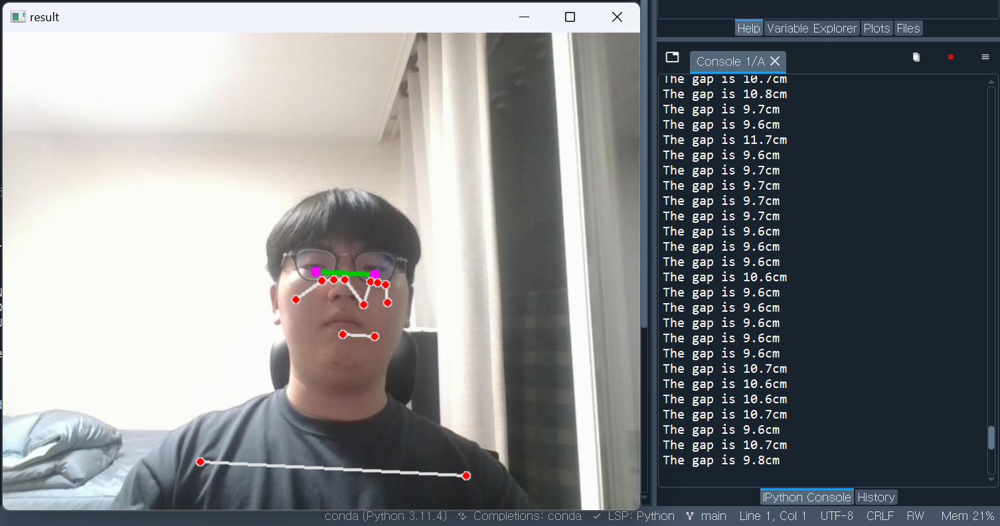
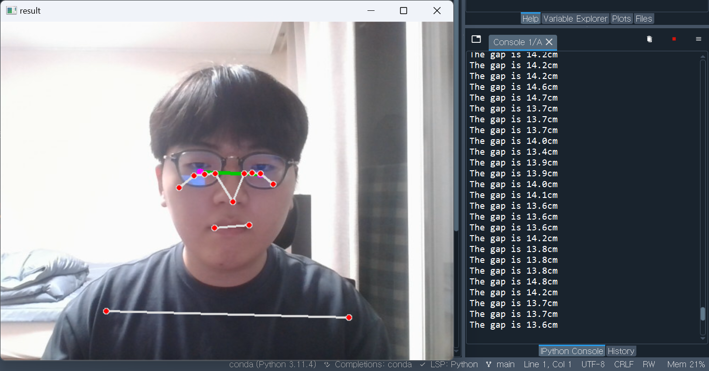

# ImprovingPoseOnPC

Users who frequently use a PC often unconsciously tilt their heads towards the monitor, leading to poor posture. Additionally, maintaining a healthy posture while using the keyboard can be challenging. To address these issues and prevent the development of various unhealthy habits, a program has been devised.

## Objectives
1. Prevention of "Turtle Neck" posture.
2. Prevention of eye dryness.
3. Muscle stretching exercises.
4. To be determined.

## Resources Used
* OpenCV
* Mediapipe
* Python
* CVZone

## How to make

### 1. Prevention of "Turtle Neck" posture.
"Turtle neck," or forward head posture, develops when a person maintains a hunched position for an extended period. One method to prevent this is by using a webcam to issue warnings when the distance between the monitor, webcam, head, and body exceeds a certain threshold.
	- How to measure the distance between the webcam and the head: Utilize the fact that the distance between the irises remains constant. By comparing the actual distance between the irises to the distance captured by the webcam at a specific position, you can calculate the distance between the eyes and the camera.
	- How to measure the distance between the webcam and the body: When using a PC, the webcam and body are generally parallel. By leveraging this, you can determine the distance between the shoulders by comparing the actual shoulder width to the distance between shoulder points captured by the webcam at a specific position, allowing you to calculate the distance between the body and the camera.

### 2. Prevention of eye dryness.
An appropriate blink rate is around 15 to 20 times per minute.
Utilizing Mediapipe's FaceLandmark, which tracks the boundaries of the eyes, enables the measurement of blink frequency.

### 3. Muscle stretching exercises.
If a person's face is illuminated by the webcam for an extended period, it implies that the individual has been sitting in front of the PC for a prolonged duration. After a specific period, triggering a warning alert can encourage stretching to promote better posture.

### 4. To be determined.
To be continued...

## License
MIT License
Copyright (c) <2023> <PBirdDragon>

Permission is hereby granted, free of charge, to any person obtaining a copy
of this software and associated documentation files (the "Software"), to deal
in the Software without restriction, including without limitation the rights
to use, copy, modify, merge, publish, distribute, sublicense, and/or sell
copies of the Software, and to permit persons to whom the Software is
furnished to do so, subject to the following conditions:

The above copyright notice and this permission notice shall be included in all
copies or substantial portions of the Software.

THE SOFTWARE IS PROVIDED "AS IS", WITHOUT WARRANTY OF ANY KIND, EXPRESS OR
IMPLIED, INCLUDING BUT NOT LIMITED TO THE WARRANTIES OF MERCHANTABILITY,
FITNESS FOR A PARTICULAR PURPOSE AND NONINFRINGEMENT. IN NO EVENT SHALL THE
AUTHORS OR COPYRIGHT HOLDERS BE LIABLE FOR ANY CLAIM, DAMAGES OR OTHER
LIABILITY, WHETHER IN AN ACTION OF CONTRACT, TORT OR OTHERWISE, ARISING FROM,
OUT OF OR IN CONNECTION WITH THE SOFTWARE OR THE USE OR OTHER DEALINGS IN THE
SOFTWARE.

from wikipedia

This sentences are translated with chatGPT 3.5

----

# PC사용할 때의 자세를 개선시키는데에 도움을 주는 프로그램
PC를 자주 사용하는 사용자들은 무의식적으로 고개를 모니터로 기울게된다. 또한 키보드를 사용하기 위해 자세가 망가지기 쉽다.
이 외에도 다양한 안 좋은 습관들이 몸에 새겨지는 것을 막거나 억제해보고자 기획했다.

## 목표
1. 거북목 방지
	- 모니터를 보다보면 우리는 빈번하게 목을 앞으로 하여 모니터와 가까워진다. 이러한 자세가 습관이 되면, 우리는 거북목을 가지게 된다. 거북목 증후군은 목에 관절염을 유발하고, 호흡에 지장을 주며, 심한 두통에 시달리게 한다. 또한 뒷목, 어깨, 허리 등에도 통증을 유발시킨다.
2. 안구건조증 방지
	- 우리가 모니터를 오랫동안 본다면, 자연스럽게 눈의 깜빡임이 적어진다. 적어진 깜빡임은 눈을 건조하게 하며, 안구 표면 손상을 유발한다. 안구건조증이 심해지면, 눈에서 다양한 통증을 유발한다.
3. 근육 스트레칭
	- PC앞에서 우리는 시간의 흐름을 느끼기 힘들다. 장시간 똑같은 자세를 유지하는 것은 몸의 근육에 상당한 부담을 주기 때문에 우리는 일정 시간마다 근육을 스트레칭해줘야한다.
4. 미정
	- 웹캠을 통해 우리의 자세와 태도를 개선시킬 수 있는 다른 목표와 방법을 계속 생각하고 있다.

## 사용한 리소스
* OpenCV
* Mediapipe
* Python
* CVZone

## 구현 방식

### 1. 거북목 방지
거북목은 목이 구부정하게 앞으로 나오는 자세를 장기간 취할 경우 생기게 된다. 이를 방지하는 방법은 모니터의 웹캠과 머리, 몸 사이의 거리의 차가 일정 수준 이상을 벗어날 경우 경고를 주는 것이다.

- 웹캠과 머리 사이의 거리를 구하는 방법: 두 홍채 사이의 거리는 일정하다는 사실을 이용할 것이다. 실제 홍채 사이의 거리와 특정 위치에서의 웹캠에서의 홍채 사이의 거리를 이용하여 눈과 카메라 사이의 거리를 구할 수 있다.
	
- 웹캠과 몸 사이의 거리를 구하는 방법: 우리가 pc를 사용할 때에는 웹캠과 몸을 평행하게 위치시킨다. 이를 통해 실제 어깨 사이의 거리, 특정 위치에서의 웹캠에서의 어깨 사이의 거리를 이용하여 몸과 카메라 사이의 거리를 구할 수 있다.

|목을 넣은 상태|목을 뺀 상태|
|---|---|
|||

### 2. 안구건조증 방지 (미구현)
적절한 눈 깜빡임은 분당 15~20회이다.
Mediapipe의 FaceLandmark는 눈의 경계를 추적하기 때문에 이를 이용하여 눈의 깜빡임을 측정할 수 있다.

### 3. 근육 스트레칭 (미구현)
얼굴이 특정 시간 이상 웹캠에 비춰진다면, 그 사람이 PC앞에서 장기간 앉아 있다는 뜻이다. 특정 시간이 지나면 경고 알람을 띄워 스트레칭을 유도할 수 있다.

### 4. 미정

## 라이선스
MIT License
Copyright (c) <2023> <PBirdDragon>

Permission is hereby granted, free of charge, to any person obtaining a copy
of this software and associated documentation files (the "Software"), to deal
in the Software without restriction, including without limitation the rights
to use, copy, modify, merge, publish, distribute, sublicense, and/or sell
copies of the Software, and to permit persons to whom the Software is
furnished to do so, subject to the following conditions:

The above copyright notice and this permission notice shall be included in all
copies or substantial portions of the Software.

THE SOFTWARE IS PROVIDED "AS IS", WITHOUT WARRANTY OF ANY KIND, EXPRESS OR
IMPLIED, INCLUDING BUT NOT LIMITED TO THE WARRANTIES OF MERCHANTABILITY,
FITNESS FOR A PARTICULAR PURPOSE AND NONINFRINGEMENT. IN NO EVENT SHALL THE
AUTHORS OR COPYRIGHT HOLDERS BE LIABLE FOR ANY CLAIM, DAMAGES OR OTHER
LIABILITY, WHETHER IN AN ACTION OF CONTRACT, TORT OR OTHERWISE, ARISING FROM,
OUT OF OR IN CONNECTION WITH THE SOFTWARE OR THE USE OR OTHER DEALINGS IN THE
SOFTWARE.

from wikipedia